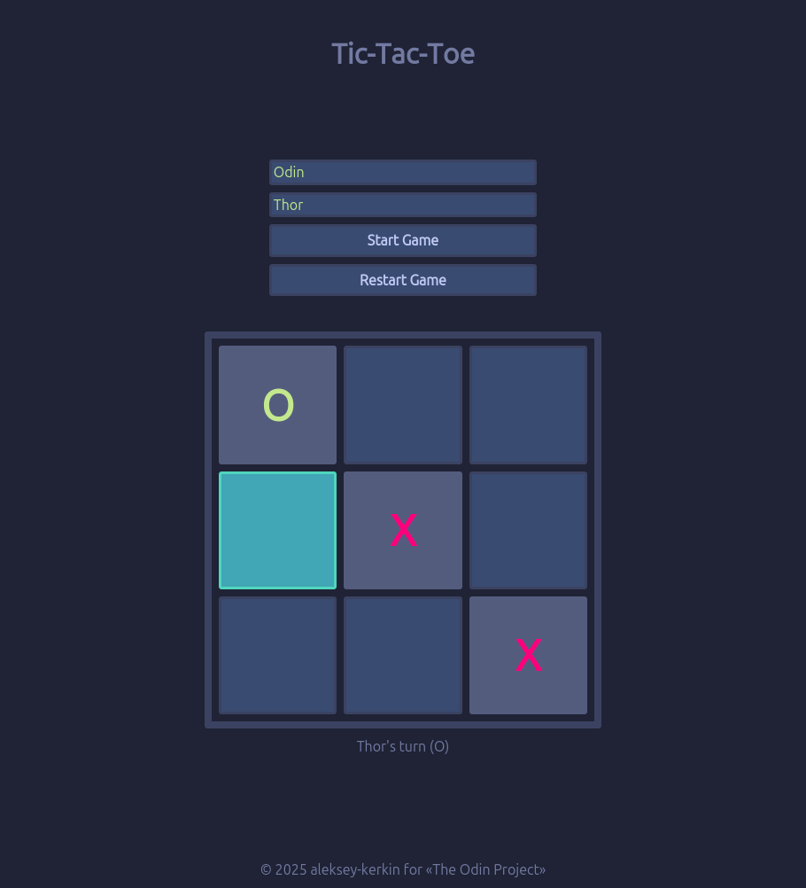

# Tic Tac Toe 🎮

A modern implementation of the classic Tic Tac Toe game with accessibility features and custom styling.

## Features ✨

- ♟️ Player customization with names
- 🏆 Win detection and game history
- 🎨 Themed UI with cosmic styling
- ♿ Screen reader support
- 📱 Responsive mobile-first design
- 🎉 Winner animation effects

## Technologies Used 🛠️

## Accessibility ♿

- ARIA labels for all interactive elements
- Screen reader-friendly announcements
- Responsive touch targets

## Acknowledgements 🙏

This project was made possible by:

- [The Odin Project](https://www.theodinproject.com) for their excellent curriculum
- [SVG Repo](https://www.svgrepo.com) for the favicon resources
- Open source community for invaluable resources

---

  Built with ❤️ by <a href="https://github.com/aleksey-kerkin">Aleksey Kerkin</a>

